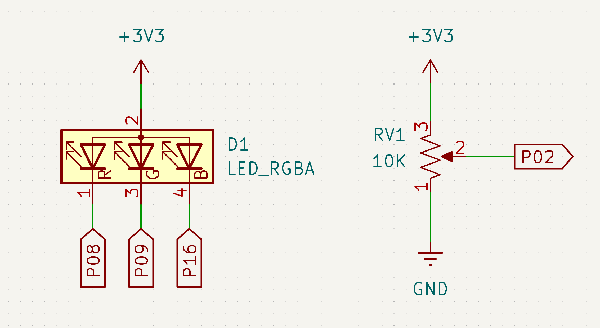

# mb2-hsv: HSV setting for an RGB LED using the micro:bit v2

Rowan Sheets 2026

Code for the BBC micro:bit v2 that reads from a potentiometer to control HSV values and light an RGB LED to that value.

## How to run
1. Make sure you have all the requirements to use embedded rust with the BBC micro:bit (instructions available
[here](https://docs.rust-embedded.org/discovery-mb2/index.html))
2. Run the command `cargo embed`
3. Build the circuit detailed below

4. The letter displayed on the mb2 will show which attribute you are adjusting, pressing the a and b buttons will cycle
them and turning the potentiometer will adjust the currently selected attribute.

## Credits
hsv-schematic.png: Bart Massey